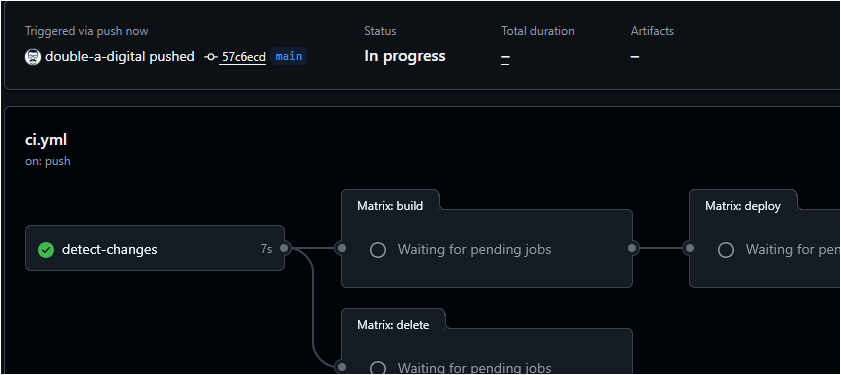
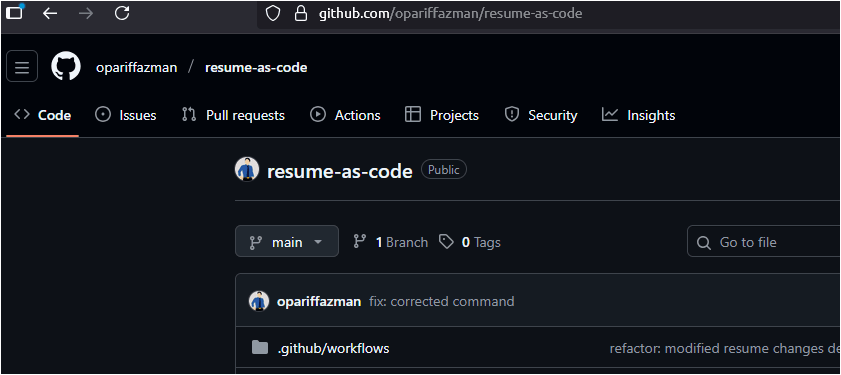
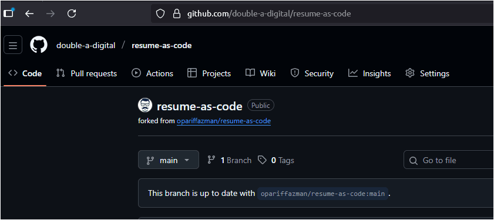
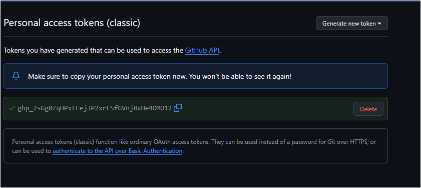
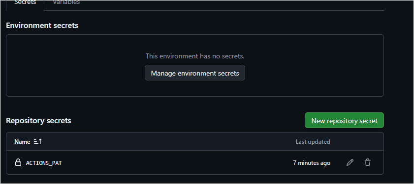
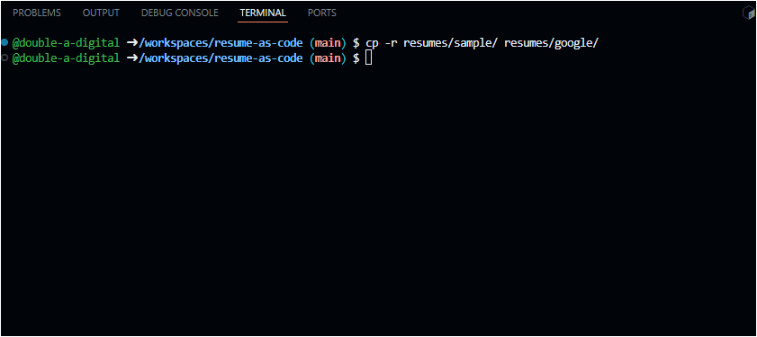

Manage multiple resumes, with each getting its own dedicated website.

Automatically generate a professional resume with a proper PDF version, hosted for free via GitHub Pages.

Powered by: [JSONResume](https://jsonresume.org/) + Engineering [Theme](https://github.com/skoenig/jsonresume-theme-engineering) + [GH Pages](https://pages.github.com/)

# Behold...



## Features

- **Multi-Resume Support** - Manage multiple resumes for different job roles in one place.
- **One Source of Truth** - Just edit the `resume.json` for the resume you want to change.
- **Automated Deployment** - Websites are generated and deployed on every resume push.
- **Live Websites** - Each resume is hosted with GitHub Pages for free in its own repository.
- **Download PDF** - A print optimized version is available as downloadable PDF.
- **Clean Theme** - Minimal, readable and optimized to ATS standards.

---

## Instructions

1.  Fork this repo

    

2.  Enable GitHub Actions

    

3.  Create a Personal Access Token

    

4.  Add a new secret: `ACTIONS_PAT` with the token you just created

    

5.  Open codespaces for easy editing

    

6.  Copy the sample resume by running below command in the terminal

    ```bash
    cp resumes/sample resumes/google/ -r
    ```

    

7.  After editing `resumes/google/resume.json`, commit and push the changes

    


All done! You'll be able to access your live site at `https://<github_username>.github.io/google-resume`

---

## Advanced (Optional)

Want to preview your resume before pushing?

Get [NodeJS](https://docs.npmjs.com/downloading-and-installing-node-js-and-npm) first

1.  Install dependencies:
    ```bash
    npm install
    npx playwright install chromium
    ```

2.  To build a specific resume, run the `build-resume.sh` script with the `FILE_PATH` environment variable:
    ```bash
    FILE_PATH=resumes/data-scientist ./scripts/build-resume.sh
    ```

You’ll find the generated `index.html`, `resume.html`, and `resume.pdf` inside the `resumes/data-scientist/` folder.

## Summary

1.  You make a copy of the `resumes/sample` directory to a new one (e.g. `resumes/google/`).
2.  You modify the `resume.json` file in this `resumes/google/` with your actual details.
3.  You push your code to GitHub so GitHub Actions automatically builds the site and PDF.
4.  The output is deployed to a separate resume repository (e.g., `google-resume`) with GitHub Pages enabled.
5.  If you delete any resume folder, the corresponding repository is also deleted.

This lets you keep your resumes repository separate from the live resume websites.

Happy Job Hunting!
